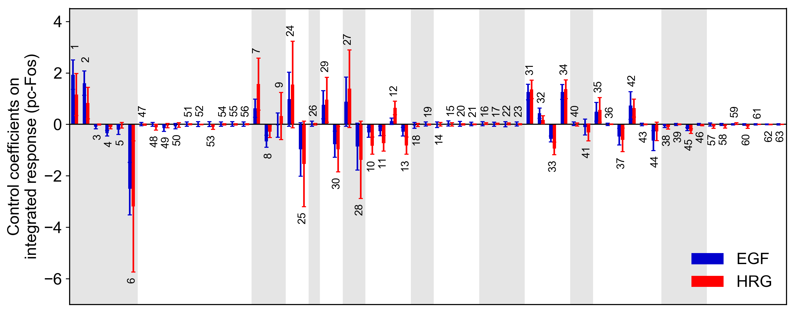

# BioMASS

## Modeling and Analysis of Signaling Systems


Mathematical modeling is a powerful method for the analysis of complex biological systems. Although there are many researches devoted on producing models to describe dynamical cellular signaling systems, most of these models are limited and do not cover multiple pathways. Therefore, there is a challenge to combine these models to enable understanding at a larger scale. Nevertheless, larger network means that it gets more difficult to estimate parameters to reproduce dynamic experimental data needed for deeper understanding of a system.

To overcome this problem, we developed BioMASS, a modeling platform tailored to optimizing mathematical models of biological processes. By using BioMASS, users can efficiently optimize kinetic parameters to fit user-defined models to experimental data, while performing analysis on reaction networks to predict critical components affecting cellular output.

## Description
BioMASS is a biological modeling environment tailored to

1. Parameter Estimation of ODE Models
1. Sensitivity Analysis

currently implimented for modeling immediate-early gene response ([Nakakuki *et al.*, ***Cell***, 2010](https://doi.org/10.1016/j.cell.2010.03.054)).

## Dependencies
> - numpy
> - scipy
> - matplotlib
> - seaborn

## Parameter Estimation of ODE Models (*n* = 1, 2, 3, · · ·)
The temporary result will be saved in ```out/n/``` after each iteration.
```bash
$ nohup python optimize.py n &
```
Progress list: ```out/n/out.log```
```
Generation1: Best Fitness = 1.726069e+00
Generation2: Best Fitness = 1.726069e+00
Generation3: Best Fitness = 1.726069e+00
Generation4: Best Fitness = 1.645414e+00
Generation5: Best Fitness = 1.645414e+00
Generation6: Best Fitness = 1.645414e+00
Generation7: Best Fitness = 1.645414e+00
Generation8: Best Fitness = 1.645414e+00
Generation9: Best Fitness = 1.645414e+00
Generation10: Best Fitness = 1.645414e+00
Generation11: Best Fitness = 1.645414e+00
Generation12: Best Fitness = 1.645414e+00
Generation13: Best Fitness = 1.645414e+00
Generation14: Best Fitness = 1.645414e+00
Generation15: Best Fitness = 1.645414e+00
Generation16: Best Fitness = 1.249036e+00
Generation17: Best Fitness = 1.171606e+00
Generation18: Best Fitness = 1.171606e+00
Generation19: Best Fitness = 1.171606e+00
Generation20: Best Fitness = 1.171606e+00
```

- If you want to continue from where you stopped in the last parameter search,
```bash
$ nohup python optimize_continue.py n &
```
- If you want to search multiple parameter sets (from *n1* to *n2*) simultaneously,
```bash
$ nohup python optimize.py n1 n2 &
```

## Visualization of Simulation Results
```python
simulate_all(viz_type, show_all, stdev)
```
**viz_type** : str

- ```'average'```
    : The average of simulation results with parameter sets in ```out/```.

- ```'best'```
    : The best simulation result in ```out/```, simulation with ```best_fit_param```.

- ```'original'```
    : Simulation with the default parameters and initial values defined in ```set_model.py```.

- ```'n(=1,2,...)'```
    : Use the parameter set in ```out/n/```.

**show_all** : bool
- Whether to show all simulation results.

**stdev** : bool
- If True, the standard deviation of simulated values will be shown (only when ```viz_type == 'average'```).

```python
import warnings
warnings.filterwarnings('ignore')

from biomass.param_estim import simulate_all
            
simulate_all(viz_type='average', show_all=False, stdev=True)
```


Points (blue diamonds, EGF; red squares, HRG) denote experimental data, solid lines denote simulations

## Sensitivity Analysis
The single parameter sensitivity of each reaction is defined by<br>

*s<sub>i</sub>*(*q*(**v**),*v<sub>i</sub>*) = *∂* ln(*q*(**v**)) / *∂* ln(*v<sub>i</sub>*) = *∂*_q_(**v**) / *∂*_v<sub>i</sub>_ · *v<sub>i</sub>* / *q*(**v**)

where *v<sub>i</sub>* is the *i*<sup>th</sup> reaction rate, **v** is reaction vector **v** = (*v<sub>1</sub>*, *v<sub>2</sub>*, ...) and *q*(**v**) is a target function, e.g., time-integrated response, duration. Sensitivity coefficients were calculated using finite difference approximations with 1% changes in the reaction rates.

```python
analyze(metric, style)
```

**metric** : str
- ```'amplitude'```
    : The maximum value.
- ```'duration'```
    : The time it takes to decline below 10% of its maximum.
- ```'integral'```
    : The integral of concentration over the observation time.

**style** : str
- ```'barplot'```
- ```'heatmap'```

```python
from biomass.analysis import reaction, nonzero_init

reaction.analyze(metric='integral', style='barplot')
```


Control coefficients for integrated pc-Fos are shown by bars (blue, EGF; red, HRG). Numbers above bars indicate the reaction indices, and error bars correspond to simulation standard deviation.

## Installation
    $ git clone https://github.com/okadalabipr/biomass.git

## References
- Nakakuki, T. *et al.* Ligand-specific c-Fos expression emerges from the spatiotemporal control of ErbB network dynamics. *Cell* **141**, 884–896 (2010). https://doi.org/10.1016/j.cell.2010.03.054

- Kimura, S., Ono, I., Kita, H. & Kobayashi, S. An extension of UNDX based on guidelines for designing crossover operators: proposition and evaluation of ENDX. *Trans. Soc. Instrum. Control Eng.* **36**, 1162–1171 (2000). https://doi.org/10.9746/sicetr1965.36.1162

- Kimura, S. & Konagaya, A. A Genetic Algorithm with Distance Independent Diversity Control for High Dimensional Function Optimization. *J. Japanese Soc. Artif. Intell.* **18**, 193–202 (2003). https://doi.org/10.1527/tjsai.18.193

- Kimura, S., Nakakuki, T., Kirita, S. & Okada, M. AGLSDC: A Genetic Local Search Suitable for Parallel Computation. *SICE J. Control. Meas. Syst. Integr.* **4**, 105–113 (2012). https://doi.org/10.9746/jcmsi.4.105

- Kholodenko, B. N., Demin, O. V. & Westerhoff, H. V. Control Analysis of Periodic Phenomena in Biological Systems. *J. Phys. Chem. B* **101**, 2070–2081 (1997). https://doi.org/10.1021/jp962336u

- Kholodenko, B. N., Hoek, J. B., Westerhoff, H. V. & Brown, G. C. Quantification of information transfer via cellular signal transduction pathways. *FEBS Lett.* **414**, 430–434 (1997). https://doi.org/10.1016/S0014-5793(97)01018-1

## License
[MIT](/LICENSE)